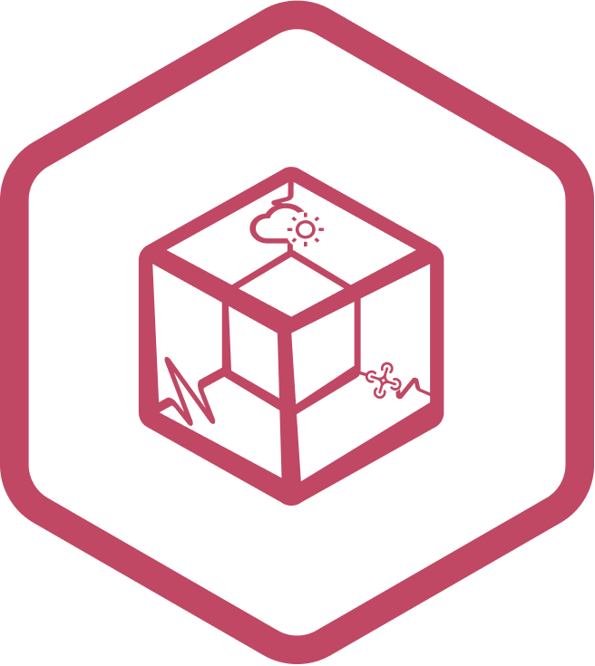

..
    This file is part of Python cube4health package.
    Copyright (C) 2025 HARMONIZE/INPE.

    This program is free software: you can redistribute it and/or modify
    it under the terms of the GNU General Public License as published by
    the Free Software Foundation, either version 3 of the License, or
    (at your option) any later version.

    This program is distributed in the hope that it will be useful,
    but WITHOUT ANY WARRANTY; without even the implied warranty of
    MERCHANTABILITY or FITNESS FOR A PARTICULAR PURPOSE. See the
    GNU General Public License for more details.

    You should have received a copy of the GNU General Public License
    along with this program. If not, see <https://www.gnu.org/licenses/gpl-3.0.html>.

=====================================
cube4health 
=====================================

.. image:: https://img.shields.io/badge/License-GPLv3-green
        :target: https://github.com/Harmonize-Brazil/cube4health/blob/master/LICENSE
        :alt: Software License

.. image:: https://readthedocs.org/projects/cube4health/badge/?version=latest
        :target: https://cube4health.readthedocs.io/en/latest/
        :alt: Documentation Status

.. image:: https://img.shields.io/badge/lifecycle-experimental-orange.svg
        :target: https://www.tidyverse.org/lifecycle/#experimental
        :alt: Software Life Cycle

.. image:: https://img.shields.io/github/tag/Harmonize-Brazil/cube4health.svg
        :target: https://github.com/Harmonize-Brazil/cube4health/releases/latest
        :alt: Release

About
=====

Package **cube4health** is a data acquisition, processing, and publishing toolkit designed to streamline the integration of health, climate, and drone imagery data from Brazil and any other country adhering to standardized protocols. It enables the efficient handling of heterogeneous data sources into a unified structure, supporting scalable workflows for data ingestion, transformation, and dissemination.

Installation
============

Install GDAL library and its header files on your system (Ubuntu):

.. code-block:: shell

        sudo apt-get update && sudo apt-get upgrade
        sudo apt-get install -y g++ && sudo apt-get install -y libgdal-dev

Source code from Github:

.. code-block:: shell

        pip install git+https://github.com/Harmonize-Brazil/cube4health.git@dev

Alternative using *Python Virtual Environment*:

1. Clone the software repository:

.. code-block:: shell

        git clone https://github.com/Harmonize-Brazil/cube4health.git@dev

2. Go to the source code folder:

.. code-block:: shell

        cd cube4health

3. Create a new virtual environment linked to Python 3.10:

.. code-block:: shell

        python3.10 -m venv venv

4. Activate the new environment:

.. code-block:: shell

        source venv/bin/activate

5. Update pip and setuptools:

.. code-block:: shell

        pip3 install --upgrade pip wheel setuptools

6. Install in development mode `-e (option)`:

.. code-block:: shell

        pip3 install -e .[all]

**Obs.:** The development mode allows you to modify the code without having to rebuild the package.

Problems with GDAL import, please see these `related issues and solutions <ISSUES.rst>`_!

